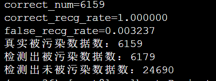
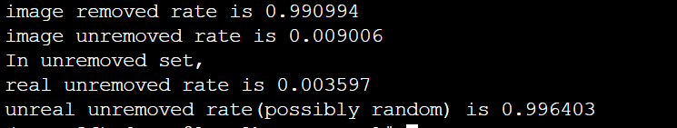

# AIPDC：Artificial Intelligence Poisoned Data Clean System

## Dependencies

This code sample is written in `tensorflow` and `tf.keras`. The code has been tested on `tensorflow==1.14` and `keras==2.2.5`.

## Getting Started:

1. clone the repo:

   ```shell
   git clone https://github.com/RidiculousDoge/AIPDC.git
   ```

2. Download sample dataset(GTSRB Dataset):

   ```shell
   cd AIPDC
   ./download_data.sh
   ```

3. Run badnet trainer and insert forward triggers into the model

   ```shell
   mkdir output
   python gen_backward/train_badnet.py --train --poison-type FF --poison-loc TL --poison-size 8 --epochs 10 --display 
   ```

   Currently supported options:

   - train: marks whether to train the model
   - poison-type: forward trigger type. Currently support FF & whitesquare
   - poison-loc: forward trigger location. Currently support TL(Top Left) & BR(Bottom Right)
   - poison-size: forward trigger size
   - epochs: train epochs
   - display: to show train plot or not

   > to evaluate the forward-trigger insert process, run
   >
   > ```bash
   > python gen_backward/eval_forward.py --checkpoint [your model]
   > ```
   >
   > to check the insert influence.

4. Run backward trigger generator and generate `mask` & `pattern` data

   ```shell
   mkdir backward_triggers
   python3 gen_backward/snooper.py --checkpoint output/badnet-FF-TL-8-10-0.97.hdf5
   ```

   - checkpoint: the model saved in Step3.

   After the implementation, `mask_FF_TL_8.npy` & `pattern_FF_TL_8.npy` will be saved to the directory`/backward_triggers`

5. Apply Poisoned Data Cleanse Algorithm

   ```shell
   mkdir retrain_models
   python clean_and_retrain/data_clean.py --checkpoint output/badnet-FF-TL-8-10-0.97.hdf5 [optional:--narrow,--retrain]
   ```

   Currently support parameters:

   - narrow: whether the mask and pattern was trained with narrowed dataset.
   - retrain: after detecting data, whether to retrain the model with the eliminated dataset.

6. Evaluate the retrained model

  ```shell
python3 clean_and_retrain/eval_clean.py --checkpoint output/retrain-FF-TL-8-06-0.98.hdf5
  ```

7. Sample result

   1. Evaluate the effect of data cleaner:
   
      
      
   2. Evaluate the effect of retrainer:
   
      
